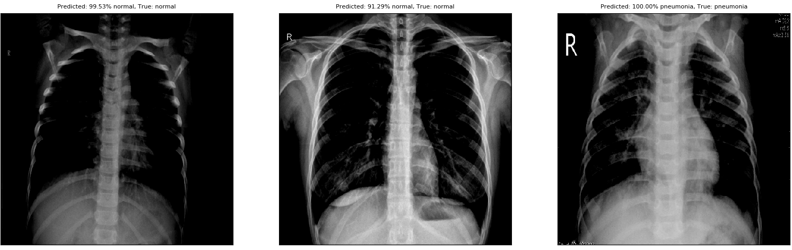
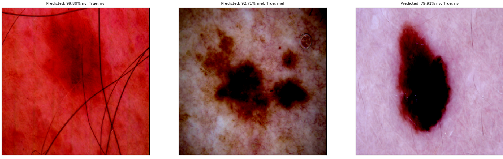
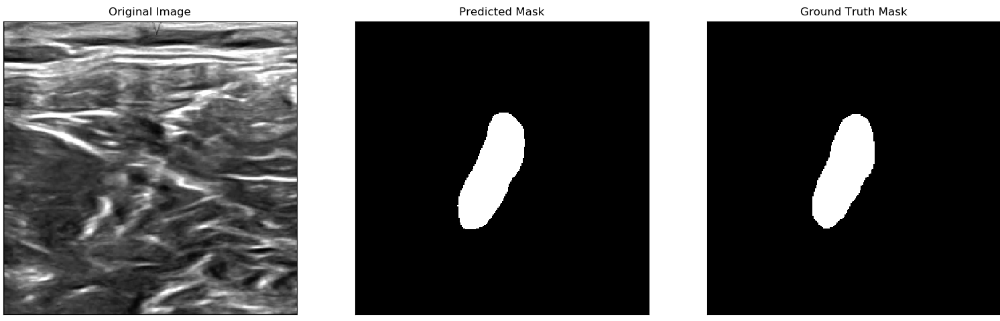
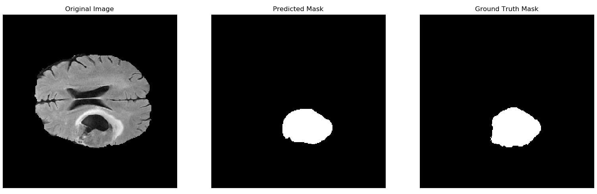
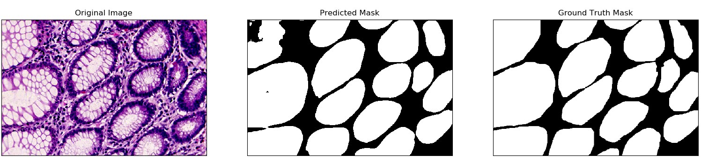
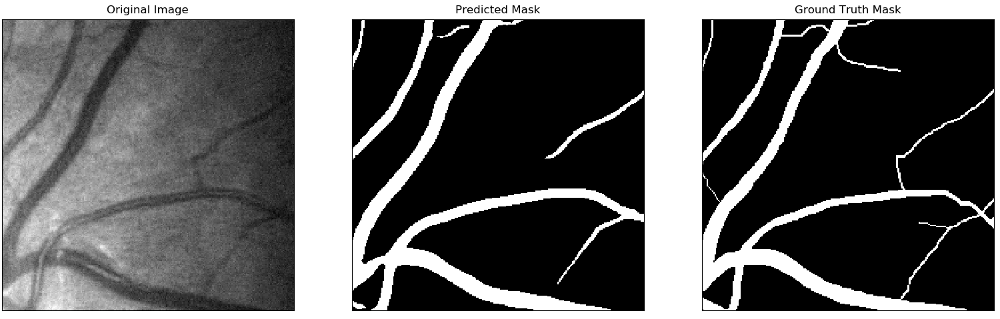

## Creating a script for a custom data set
There are three simple steps to using this module to train a CNN on a given data set. 

1. Create a configuration class that inheirits from the parent class ```Config``` and override the attributes.
```python
from cnn.config import Config

class ExampleConfig(Config):
  DATA_PATH = '../Example Dataset'
  NUM_EPOCHS = 5
  MODEL_NAME = 'inceptionv3'

```

2. Create a dataset class that inheirits from the parent class ```Dataset``` and override the ```load_data()``` method.
```python
from cnn.utils import Dataset

class ExampleDataset(Dataset):
  def load_data(self, path, input_shape):
    
    # Load training data here
    self.X["train"] = []
    self.y["train"] = []
    
    # Load training data here
    self.X["test"] = []
    self.y["test"] = []
    
    # Load validation data here (if any)
    self.X["validation"] = []
    self.y["validation"] = []
```

3. Create a main function that creates a ```Dataset```, ```Config```, and ```Model``` object calls the ```train()``` method of the ```Model``` object.

```python
from cnn.model import Model

if __name__ == "__main__":
  # Create the Config object
  config = ExampleConfig()
  
  # Create the Dataset object and load the data
  dataset = ExampleDataset()
  dataset.load_data()
    
  # Create the Model object and train
  model = Model()
  model.train(dataset, config)
  
  # Evaluate the test or validation data and view some predicitons
  model.evaluate_test(dataset, config, to_csv=True)
  model.visualize_class_predictions(dataset.X["validation"], dataset.y["validation"])
  
```

## Chest X-Ray Images (Pneumonia)
This script trains the InceptionV3 architecture to perform binary classification on Chest X-Ray images.




## Skin Cancer MNIST: HAM10000
This script trains the VGG16 architecture to perform multi-class classifcation on images if different skin-lesions,




## Ultrasound Nerve Segmentation
This script trains a smaller version of U-Net to perform binary segmentation on ultrasound images contain a particular nerve of interest.




## Brain Tumor Segmentation
This script trains a smaller version of U-Net to perform binary segmentation on brain MRI images containing tumors. This dataset is annotated as a multi-class dataset, however for simplicity the labels are combined into one class. I'd encourage you to try training with one class, then afterwords replace the last layer with a new layer with the correct number of classes, and retrain using the initial dataset using the original labels.




## H&E Gland Segmentation
This script trains a smaller version of U-Net to perform binary segmentation on H&E stained images containing gland structures. This dataset is especially tricky due to its small size. Augmentation helps tremendously to increase training sample size. A cross-entropy loss works much better when training from scratch, while a dice loss will usually cause the network to learn to classify all pixels in the image as a gland. When training from scratch, use a cross-entropy loss and then fine-tune your model by recompiling with a dice loss and then resuming training.




## Retina Vessel Segmentation
This script trains a smaller version of U-Net to perform binary segmentation on color fundus images of the retina containing blood vessels. I have found that input size of the network plays an important role during training where any size less than 256x256 has hard time learning. The original images are bigger than 256x256 and there is only ~20 of them. Therefore, random image patches are extracted from each full-size image to create the training set. The test images are deconstructed into patches as well, but not randomly.



